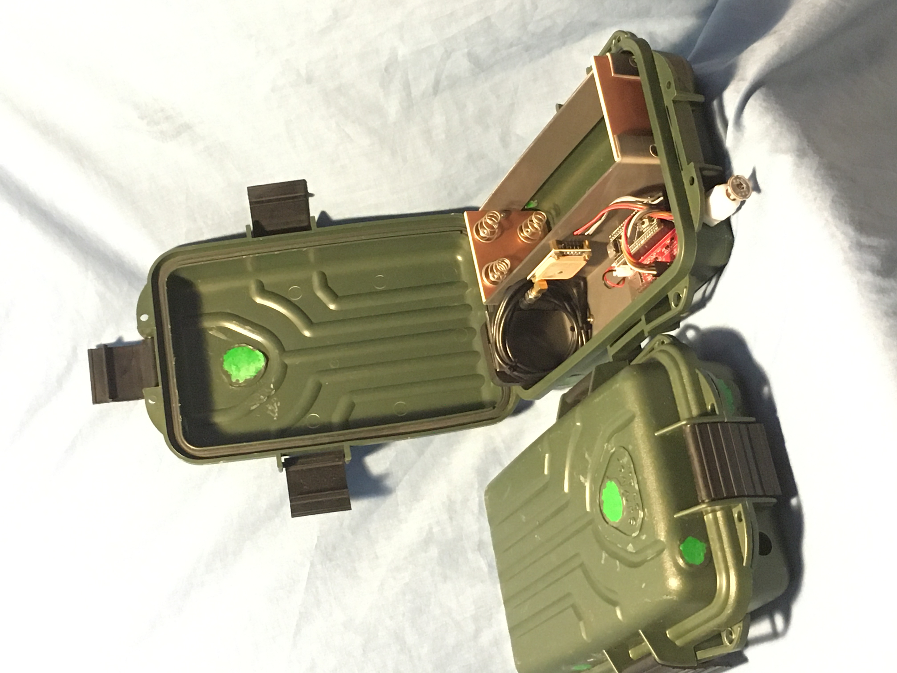

## What

K-2 is an autonomous acoustic recorder for use in
wildlife conservation.  It supports source localisation (using
multiple recorders) in 2 ways, by recording in stereo or
by accurately timestamping recorded files.  In both cases,
multiple units must be used to fully localise the source.

### Microphones
The K-2 board supports analogue (condenser) mics as well as
digital (I2S) mics.  The stereo option is only available for
digital mics, but the accurate timestamp option is available to any mic.

There are 2 connectors for the left and right digital I2S mics,
and one connector for a condenser mic.  All these mics may be
installed at the same time, the configuration file (see below)
on the micro SD card determines which to use, when, at what sample
rate, and for how long.

Most users will want to use a digital I2S mic for the
good audio quality, high dynamic range, and the fact that
calibration is not required
(performance is documented in the datasheet).
Either the
left or right channel may be used for mono recording.
Stereo is
useful for beamforming (more on this elsewhere) or for noise
reduction.  The "standard" I2S mic is the INMP441.  Although
better mics exist, this model is very common and inexpensive.  The
highest sample rate possible on the I2S port is 44100Hz (CD
quality sound).

Condenser mics are more robust in poor weather and the analogue
port can sustain a
higher max sampling rate (96kHz), but it has poorer dynamic range
(12 bits compared with 16 for the I2S mics) and more noise.  The preamp hardware
jumpers on the board should also be reconfigured to select the appropriate
anti-alias filter cutoff frequency for 96kHz.  These configurations
are printed on the reverse of the K-2 board itself.

### The micro SD card
Recordings are stored to the micro SD card, which also carries the
configuration/log file.  This file determines the recording schedule
and the recorded filename prefix, and the system logs are appended
to it.  Please see the [sample config file](src/MYSITE01.CFG) for the full
documentation.
To retrieve the recordings, remove the card and read it on your PC.
You cannot use the USB-C connector on the MCU stamp to download
the recordings.

The first partition of the micro SD card is the one used, and must
be FAT32 formatted.  32G and smaller micro SD cards come formatted
this way by default, so these are ready to use.  64G and larger
cards unfortunately come formatted as EXFAT, so these must be
reformatted as FAT32.

### The LEDs
If there is no LED activity at all, either the K-2 is powered
off (power switch is off), or it is sleeping.

#### Red LED = heartbeat
A flickering red LED indicates life, and that diagnostics are being
written to the console.

The [panic heartbeat](https://youtu.be/zevDJyfaAJU)
consists of one red flash/second
indefinitely.  This indicates a permanent error and the K-2
cannot record.  To see what this heartbeat looks like, you can
power on the K-2 with the GPS, external RTC, and SD card removed.
The K-2 responds to this error state with a panic heartbeat.

If the K-2 is operating properly, the heartbeat will be clearly slower
than the panic rate, and proportional to the
[recording](https://youtu.be/IbMdMJasuKo)
sample rate, the slowest being around 30s/flash, and the
fastest around 2s/flash.

To check for normal operation, it is enough to consider only the
red LED.  However the other LEDs can provide more information.

#### Green LED = card activity
The green LED is next to the SD card slot. It indicates SD
card activity.  When recording, this will be on.  If the SD card
is not present during power on, this LED will be on while the
K-2 probes for the card for about 20s.

#### Yellow LED = digital mic activity
A steady yellow LED indicates recording from one or both of the
digital mics.  This LED does not flash.

#### Blue LED = GPS fix
The blue LED on the MCU stamp is usually slaved to the GPS module's
PPS signal, which outputs a very accurate pulse every second.
Usually the GPS module's own LED (if present) will flash in
sympathy with it.  If the K-2 board is calibrating it's internal
RTC to GPS, the blue LED will stay on when calibration is
complete (and the panic heartbeat will show) to indicate the
calibration is complete.

### Serial connection
A serial connection can be made to the K-2 board to view diagnostics
as the recorder is starting up, or to manually set up the system
RTC (real time clock) time (see below).  To do this, you will need
a USB-to-serial adapter such as
[CH340](https://www.aliexpress.com/item/1005001552181234.html)
with [driver installed (thanks Sparkfun!)](https://learn.sparkfun.com/tutorials/how-to-install-ch340-drivers/all) attached to your laptop or computer, and
[PuTTY](https://www.chiark.greenend.org.uk/~sgtatham/putty/latest.html)
terminal emulation software running on the same to provide
the serial console.

The serial connection is also used to upload new firmware to the
K-2 board.

A serial connection is NOT required to operate the recorder
normally.  You cannot view or download files over the serial
connection, or over the USB-C connector on the MCU stamp (which
is not used).

### Time source options
The system RTC runs the recording schedule and timestamps and
must be set from some reference each time upon power up (it stops
running when the K-2 is powered off).  This reference time can be
taken from GPS, or from an external RTC, or you can set it manually
from the serial console.

#### Using GPS time
If GPS is present, then the time on the system RTC is set to GPS
time (which is in UTC) upon power up, and it is also calibrated to
the GPS clock so that the clock drift is minimised.  GPS is
periodically consulted to try to keep the accuracy to 5ms.  You
must use GPS if source localisation is a mission requirement.
GPS uses UTC time, so the recording schedule in the
configuration file must also be in UTC.  Use of local time is
not an option.  The recorder must be situated
outdoors where it can receive GPS signals.

#### Using an external RTC (DS3231)
Otherwise if the [external RTC](https://www.aliexpress.com/item/32828162429.html) is present, the time on the
system RTC is initialised from it.  The DS3231 is more accurate than the
system RTC but not accurate enough for localisation, and there is
no way to correct for clock drift over time.  However if localisation
is not a mission requirement then this is the recommended option as
it is the simplest.  The external RTC has its own backup battery to
keep time when the K-2 is powered off.  To initialise or change the
time on the external RTC, first set the time on the system RTC,
then copy it to the external RTC.  See below.

If both external RTC and GPS are installed, GPS is used.

#### Manually set the time
This option is not recommended except for testing or for later
initialising the external RTC, due to the poor uncalibrated
accuracy of the system RTC.

To set the time manually, power up the K-2 board with SD card
inserted and serial console running, but without GPS or
external RTC.  The console will display a 6-second countdown
which you interrupt by pressing any key.  Then you can
manually enter the date and time over the serial console.

#### Set the external RTC time
With the system RTC time initialised as above, you will be
presented with the option to copy the time to an external RTC.
Attach the external RTC and press Y to agree.  You can repeat this
to copy the time to other external RTCs.

To set up the date and time on a DS3231 external RTC, power on
the K-2 board with the console and external RTC attached, and with
prepared SD card inserted.  As part of the startup process, an option
will be provided to set up the system RTC.  Take this option
and enter the date and time.  You can use local time instead of
UTC but there will be no daylight savings adjustment.  Take the next option
which is to copy this internal date and time to the external
RTC.  This option will repeat, so you can replace
the external RTC with another unit to set up multiple external RTCs
to the same time in this way.  If you make a mistake, press the reset
button to start over.  The backspace key won't work.

### Notes
- The recorder tries to maintain the system RTC accuracy to 5ms or
  better, if GPS is used.  If the accuracy is estimated to be worse
  than this, GPS will be turned on automatically to resync the
  system RTC /during a recording/.
- If GPS is used, this means recordings should not be shorter
  than around 90s, and preferably 120s, for the resync to succeed.
- The recording clock is separate from the system RTC, and has
  an error that cannot be calibrated out.  If GPS is used, this
  means that recordings should not be longer than about 10
  minutes in order to limit the effect of this error.
- Actual recording sample rates will differ from nominal.  The
  recording clock cannot generate any arbitrary rate, so
  only the closest one will be used.  For example, using the digital mic
  at 44100Hz actually results in a rate of 44118Hz.  This actual rate
  will be noted in the logs, as well as in the WAV file header.
  This limitation is on top of the recording clock error.
- Maintain at least 6 seconds between consecutive recordings,
  to ensure the recorder will not oversleep the alarm for the
  subsequent recording.  This means consecutive recordings
  cannot be perfectly
  continuous since a minimum 6s gap must exist between any 2
  recordings.
- Current draw was tested with Sandisk (not Ultra) micro SD class 4.  With some
  cards, current draw can double.  You should measure the current
  draw if mission duration is critical.
  Current draw is approx. 30mA during recording (largely independent of sample
  rate and mic type), approx 2mA upon panic, and 200uA
  when sleeping between recordings.  If GPS is present, it will
  consume an extra 50mA (Neo8m) when it runs.  For the purpose of calculating power
  consumption with GPS, you can assume GPS will run for
  approx. 1 minute every hour in order to maintain system RTC accuracy
- WAV files contain the 16-bit audio recording (signed little
  endian).  For analog, the
  high 4 bits are 0 and the lower 12 bits are the native
  conversion.  For I2S mics,
  the recording discards the upper 3 bits of the native 24-bit
  conversion and retains the following 16 bits.

Comments to `htarold@gmail.com`
