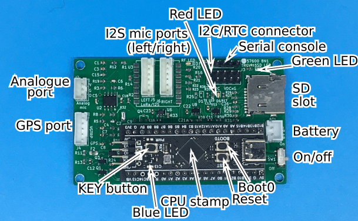

### What is K-2
K-2 is a stereo passive acoustic recorder with [GPS
option](#atgm336h-gps-module), intended
for use in wildlife conservation and research.  It is designed to
be user-hackable and takes advantage of the many low cost modules
in the Shenzhen electronics ecosystem, from the [enclosure](#abs-enclosure-158-x-90-x-60mm) to the
[processor stamp](#stm32f401-microcontroller-stamp).  It accepts from 1 to 8
[18650 lithium-ion rechargeable cells](#18650-cells-and-charging)
to record up to 600 hours
(25 days) worth of WAV files onto a [micro SD
card](#micro-sd-card-and-reformatting).


K-2 has 2 I2S digital ports, and one [analogue
port](@analogue-port), which can
be used for a condenser mic or (preamped) hydrophone.  The most
commonly available I2S mics are the low cost
[INMP441](#inmp441-i2s-mems-microphone-module), good for
general purpose use; and the tight tolerance Knowles SPH0645, for
calibrated recordings.  The stereo feature can be used to beamform
the direction of acoustic events, or to reduce noise.

K-2 uses a low-cost [DS3231 external RTC
module](#ds3231-external-rtc-module), but can take an [ATGM336H
GPS module](#atgm336h-gps-module) for accurate timing suitable for
localising acoustic events using TDOA, with multiple K-2 recorders
in the field.

### Quick start
In the following, you can attach a [serial console](#serial-connection)
to view the diagnostics and follow along, but the LEDs tell the
same story.

1. Unplug the GPS cable, and make sure the SD card slot is *empty*.
   The [DS3231 external RTC module](#ds3231-external-rtc-module) should remain attached.
1. Power on the K-2.  In this configuration, K-2 will go into
   **reformat mode**.
1. You can see the [green LED](#connectors-and-pinouts) light up (indicating SD access),
   then go off when K-2 realises there is no SD card.
   The [blue LED](#connectors-and-pintouts) then turns on and stays on, which is what K-2
   does when waiting for you to do something.
1. So insert a [micro SD card](#micro-sd-card-and-reformatting).  This
   card will be reformatted and all existing data on it will be deleted.
1. Press and release the KEY button [next to the blue LED](#connectors-and-pinouts) on
   the stamp.  The blue LED turns off and the green one
   turns on to indicate that reformatting has begun.
1. In a minute or so the green LED goes off and blue goes on
   again.  This time, K-2 is prompting you to replace the SD card
   to reformat another one if you wish.
1. Power off the K-2 instead and examine the micro SD card on your
   computer.  There will be a fully workable sample config file
   `MYSITE01.CFG` on it, containing instructions on how to modify
   it to suit your needs.
1. **Now set the time.**  Edit the `set_time` line in
   `MYSITE01.CFG`, uncommenting it and putting in the actual
   date and time.  Save the changes and replace the SD card in
   the K-2.
1. **Record for real!** Power on the K-2, ensuring the DS3231 external RTC is attached.
1. This time wait for the blue led to flash on for one second,
   after which K-2 board goes to sleep (nothing is lit).
   This indicates that startup has been successful and the K-2
   will sleep until the next scheduled recording time.
1. Wait until the K-2 wakes, when it will begin recording, as
   indicated by the lit green LED.  Let it record a few files,
   then you can power off the K-2.
1. Reexamine the SD card on your computer.  The .WAV files
   are the recordings you have just made.  The
   [filenames](#files-and-data) of the
   recordings are based on the config file's name and
   the date and time.  You'll want to rename the config file to
   reflect your project or the station the recorder was installed
   at, so the recordings will have meaningful filenames.
1. You can **play back** the recordings.  Depending on what
   microphones were installed, some recordings or channels may
   be silent.  The .WAV files also contain other information
   that you can view with a RIFF viewer application.
1. There may be files with filenames ending in 3 digits, such as
   `.123`.  These are temporary files that are left behind if
   the K-2 was powered off while a recording was in progress.  You
   can remove such files.
1. If you examine the `MYSITE01.CFG` sample config file, you'll see
   that diagnostics have been appended to the file.  If you had
   the [serial console](#serial connection) connected, diagnostics
   like these would have
   been displayed on the serial console as well.  You can edit out these
   diagnostics, or you can let them accumulate across multiple
   recoding sessions.
1. You'll also notice the `set_time` directive that you edited
   earlier has been commented out in the config file.
   This is so the `set_time` will not be repeatedly applied.

### Less-quick start using GPS
1. Add a new rule to the config file to make stereo recordings
   of 110s duration, every 2 minutes, sampling at 8kHz (Hint:
   there is a similar commented-out rule already there).
   Place this rule quite high in the file, so it takes
   highest precedence.  Recordings at least 90 seconds long give GPS a
   better chance of obtaining a fix.  This is because GPS is
   only ever run piggy-backed on an audio recording to save power.
1. Insert the SD card, connect the GPS, take the K-2 outdoors
   where it can get good GPS reception, and power on the K-2.
   The DS3231 will not be used but it can remain attached.
1. Similar to the [Quick start](#quick-start), the green LED will be off
   most of the time during startup but will flash when the SD card
   is being probed and the config is read.
   What's different from the quick start is you'll see the GPS
   module turn on (its LED will light) during startup as it
   tries to get a fix.  When a fix is eventually obtained (which
   might take a minute), the blue LED
   will begin flashing in sympathy with the GPS module.
   Completion of startup is signalled when the blue LED turns off
   *and the GPS module's LED also turns off* as the K-2 goes
   to sleep until the next time to record.
1. Let the K-2 make recordings over the following 20 to 30
   minutes.  As the onboard RTC continues to drift with each
   successive recording, eventually the error will become
   intolerable and the GPS will be run again to bring
   the onboard RTC back in line.
1. Let the K-2 run for a few hours if you have the time.  You'll see
   that GPS is run less and less often as the onboard RTC rate is
   trimmed to be more accurate.  Eventually, GPS may run only once
   every hour, or less often.
1. Power off the K-2 and take a look in the SD card.  The filenames
   of the recordings now contain valid milliseconds instead of `xxx`,
   and there is now additional information in the WAV file visible with a
   RIFF viewer.  In the system log, you can see how calibration
   progressed by tracking `calr=` and `drift_ppm=`.

### Notes
#### Setting the time another way
Alternatively, you can enter the time from
the serial console.  Power on the K-2 with the
serial console connected.  After a few hardware checks, you'll
be given the option to input a new time at the console, which you must take
before it times out.  The time on the DS3231 would also be set
automatically, if it was attached. 

Now that the onboard RTC is set, you can take the next option which
is to copy the time from onboard RTC to other DS3231 modules.
You can then use these DS3231 modules on other K-2 units to
synchronise them all.

#### The other LEDs
[Refer to the layout](#connectors-and-pinouts)
The yellow LED indicates that the MEMS mics are powered on.  There is
no LED to indicate if the analogue port is powered on.  The red LED
(hidden behind the DS3231 module in the current PCB) indicates that
there is output
on the serial console, which means the CPU is alive.
On permanent failure, only the red LED will be active, flashing
a failure message every 4 seconds indefinitely.  If you connect a
serial console (see below), you'll see the failure message that is
causing the flashing.  This message may or may not be also copied
into the system log, depending on the type of failure.

#### Using DS3231
This is the most convenient clock to use.  As purchased, its
oscillator will not be turned on, so its battery will last
indefinitely.  After the time is initially set, the clock will
be running whether or not it is installed in the K-2, and the
battery will deplete perhaps after half a year.

One way to set or change the time is shown in the Quick start.
Another way is to use the serial console.

With the serial console attached and the DS3231 installed, power
on the K-2.  You'll have 6 seconds to interrupt a prompt to
change the onboard RTC time.  Do so, and enter the date and
time.
This time will be used to set the onboard RTC as well as the
DS3231 module that is attached.

Next you'll get another 6 seconds to accept the option to set the
time on additional DS3231 modules, based on the now-valid
onboard RTC.  If you need multiple K-2 recorders to be
synchronised, you can do this for all their DS3231 modules using
the current K-2 board.

#### Micro SD card and reformatting
K-2 needs a micro SDHC or SDXC card (i.e. greater than 2GB in size)
formatted with FAT32.  64G and larger cards typically come formatted
as EXFAT rather than FAT32, so these need to be reformatted
as FAT32.  This can be done by the K-2 board as described in
[Quick start](#quick-start), but you can also do this on your PC.
However Windows PCs will not officially format a card larger than 32G
as FAT32, so a third party application is needed for this.  Mac and
Linux computers have no such trouble.  Then you only need to copy a
config file to the SD card to take you to step 7 in the Quick start.

The type of card greatly affects power consumption!  The best
option I've found so far is a Sandisk plain Class 10 or *under*.
Avoid anything that even displays an `A` or `U` rating as the K-2
is unable to take advantage of their extra speed, *and* it will draw
very much more power in operation.  Avoid Samsung brand SD cards.

#### Power draw and endurance
These figures are provided so you can estimate how long your
batteries will last, or how many batteries you'll need for a
given mission.

Baseline current draw is 40mA with a Class 10 SD card and no
GPS.  Current varies only slightly (1~2mA) across sample rate and
microphone.  Any A or U rating increases the draw by an extra
20mA.

It's complicated estimating the extra draw due to GPS use.
When used, GPS will optimistically run 60 seconds every
hour (_not every hour of recording time_; accuracy degrades
based on _actual time_), drawing an extra 30mA.

K-2 draws 0.3mA when asleep.  This is important if your K-2 will
spend much time asleep.

#### Calibrate K-2 before use
You can explicitly calibrate the onboard RTC, which does the
same thing as the [Less-quick start](#less-quick-start-using-gps)
without making recordings that won't be used.  You
might do this to get it out of the way before deploying for the
first time.  You can also batch calibrate a large number of
STM32F401 stamps on a single GPS-equiped K-2, since the internal
RTC and calibration values live on the stamp.  Even if only the
DS3231 external RTC will be used, a calibrated onboard RTC is
useful.

To calibrate:
- Ensure the SD card slot is empty but the GPS cable is inserted.
- Then power on the K-2 outdoors in an area with a clear view to the sky.
- The blue LED and the LED on the GPS will flash as the K-2 detects the GPS.
- The green LED will turn on as the K-2 tries to detect the
  non-existent SD card.
- When the K-2 realises the SD card slot is empty but GPS is
  present, it goes into
  calibration mode.  During this time, only the GPS LED and the
  red led will be on, the latter only flickering reassuringly from
  time to time.
- Within a minute or so into calibration mode, both the blue LED
  and the GPS LED will begin flashing as a fix is obtained.
- After a few minutes the blue LED will stop flashing but remain
  on.  At this point the K-2's clock is calibrated and you can
  power off the K-2.

#### Files and data
The config file lends its name to the data files.  In the example
the config file name is `MYSITE01.CFG`, so data files will take
the form of
`MYSITE01-S-21-08-27_23-42-01.123.wav` and all of them reside
in the root directory.  The config file name should be in DOS
8.3 format, i.e. in all upper case with no spaces or funny
characters.  The name should uniquely reflect the site or station where
the recorder will be installed.

Deconstructing the data file names,
- `MYSITE01` is the site/station name that is inherited from the
  config file name;
- `S` means it's a stereo recording.  `L` and `R` are also possible,
  as well as `A` for a recording on the analogue port;
  followed by the date and time.
The `.123` indicates the accuracy and nominal milliseconds,
for example:
- `.123` is nominally accurate to +/- 5ms
- `.12x` is nominally accurate to +/- 50ms
- `.1xx` is nominally accurate to +/- 500ms
- `.xxx`: All bets are off!  This happens if GPS is not used or GPSfailed to get a fix.

If GPS is used, then dates and times are automatically in UTC.
If the DS3231 external RTC module is used though, then the dates
and times are however you set them, but there will be no daylight
savings adjustment.

More information regarding accuracy can be found in the log file
appended to the config file: look for `error\_ms=` string, which
traces the degradation of accuracy over time.  You can delete
the log information in the config file when it gets too
unwieldy, leaving just the initial config section.  It's also ok to
leave the log data there, there is no need to trim the logs
before every deployment.

The data files also record GPS and other information in a
structure in the WAV file, which you can view with a RIFF file
viewer (since WAV is a type of RIFF file).

#### Analogue port
The analogue port has a bit depth of 12 bits and
at 96 kHz as opposed to 16 bits/44.1 kHz for I2S.  Mostly this port
is useful for a consender mic on a long cable, which can't be used
for I2S mics, or for a preamped hydrophone.

The enclosure will need to be modified to take a cable gland (M12 or PG7)
through which the mic/hydrophone cable is threaded.  Some solder
options need to be cleared/set on the reverse of the K-2 board.
These options are:
- JP1: closed to allow phantom power on the data input.  This
  would be used for condenser mics.
- JP2: (HPF) closed = 3Hz; open = 31kHz
- JP4: (LPF) close 16kHz=; open = ?
JP2/4 are used for ultrasound (untested).

#### Firmware upgrade
Firmware images are kept in
`https://github.com/htarold/K-2/tree/main/src` and carry the
`.bin` extension.  You should use the latest firmware image.

In order to upload the firmware, you will need to be able to
establish a serial connection (do this first, see
[below](#serial-connection)) to the
board, and you will need to run a programmer application to transfer
the firware image via the serial connection to the K-2 board.

On Windows, you can use the [official ST
programmer](https://www.st.com/en/development-tools/flasher-stm32.html)
(you need to create a free account). 

On Linux you can use
[stm32flash](https://github.com/stm32duino/stm32flash) which you
will need to download and build.  The command to programme the
K-2 looks like:
```
/path/to/stm32flash -w v1.1.1.bin /dev/ttyUSB0
```
Replace `ttyUSB0` with your port name.

You'll need to ready the K-2 to accept the new firmware image.
To do this press the BOOT0 and RESET buttons on the K-2,
then release RESET, then power the K-2 on if it isn't already
on, lastly release the BOOT0 button.  This puts the STM32F401
into bootloader mode to accept a new firmware image.
Now run the programming application.

Note that uploading a new firmware image will undo the
[calibration](#calibrate-k-2-before-use).

There isn't a good solution to uploading the firmware from a
Mac.  `stm32flash` may work.

#### Serial connection

You'll need to make a serial connection to the K-2 in order to
view the diagnostics that it outputs to the serial console, or to
upload new firmware, and it's helpful in troubleshooting problems.

To make a serial connection you'll need a USB-to-serial adapter,
such as the CH340, connected via cable to the serial port on the
K-2.  The serial adapter must be set output 3.3V signals, not 5V
signals.  On the CH340, set the yellow jumper as appropriate (see above
photo, where it is set to 3.3V).

You may need to [download and install a driver](https://learn.sparkfun.com/tutorials/how-to-install-ch340-drivers/all)
for your Windows system to use the serial adapter (thanks Sparkfun!).

Make a serial connection to test that everything works.  Connect
the serial cable as shown in the illustration above; basically
`TX` and `RX` crossed, and `GND` to `GND` (see).  Don't connect
to the power pin.
With the serial adapter plugged in to your PC, and the other end
plugged in to J2 on the K-2 board, start up Putty.  Under
Connection select Serial to set the serial options:
- Serial port name, like COM10 under Windows
- Speed should be set to 57600
- Data bits should be set to 8
- Stop bits should be set to 1
- Parity should be set to None
- Flow control should be set to None
Optionally you can turn on logging (in Session\>Logging).

Power on the K-2, and you should immediately see readable output
from it.  This indicates that the serial connection is
functioning.

#### Troubleshooting tips
- If possible, power the K-2 from a bench power supply, set to
  5V output and about 100mA current limit.  Note the current draw,
  which should be around 40mA (depending on the SD card) when
  recording, 0.3mA when asleep, and around 7-10mA when idle.
- Check in the logs appended to the config file on the SD card for
  clues.
- Make a serial connection to the K-2, then power on.  The
  diagnostics can provide clues not otherwise found.
- Substitute and test: the K-2's modularity promotes this.

#### 18650 cells and charging
18650 rechargeable lithium ion cells generally come protected
(containing over- and undervoltage protection circuitry) and
unprotected.  They look the same, except the protected ones are
a couple of millimeters longer.  K-2 can take either type, but I
prefer the protected sort.

Take care of polarity when inserting the cells!

Chargers for these cells exist, but you can also charge them in
the K-2 using the TP4056 charge controller/protector powered
from a micro USB charger.  This is a feasible way to charge 1 or
2 cells, but it becomes painfully slow for 4 or more cells.

#### Gotchas
- The config/log file is corrupted??  Log entries are buffered
  for efficiency, so are not immediately synced to SD card.  Due
  to this, upon power off, the most recent log entries may
  be truncated.
- Back-to-back recordings.  It takes a couple of seconds to get
  a recording started, so if 2 recordings are scheduled back-to-back
  you should keep 6 seconds between them.  If not, the second
  recording time may be missed.

### Reference details
#### Connectors and Pinouts


##### I2S ports
The I2S ports are J5 (left channel) and J6 (right channel) on
the K-2 board.  These are JST-PH6 connectors:
1. WS aka LRCL: left/right select (output) (uppermost pin)
2. SD aka DOUT aka DATA: data (input)
3. SCK aka BCLK: clock (output)
4. VDD (3.3V power)
5. SEL is tied low (left channel, J5) or high (right channel, J6).
6. Ground

##### Analogue port
The analogue port is J7, JST-PH3 on the K-2 board:
1. Data (input)  Note: pullup can be enabled/disabled on board
(uppermost pin).
2. Ground
3. 3.3V power (not used for condenser mics).

##### Serial port
The serial port is the 4-pin 100 mil header J2 on the board:
1. 3.3V power from the K-2.  *Do not connect* to this pin, which
is the rightmost.
2. Ground, goes to the GND pin on the CH340.
3. RX, goes to the *TX* pin on the CH340.
4. TX, goes to the *RX* pin on the CH340.
You can use Arduino-style female-female jumper cables to connect
the serial adapter to J2 on the K-2.

##### GPS port
The GPS port J4, JST-PH5 on the K-2:
1. 3.3V power (uppermost pin).
2. Ground
3. GPS Tx (input)
4. GPS Rx (output)
5. 1PPS (input)
This pinout follows that on the ATGM336H.

##### Board preamp jumper options
These are solder jumpers on bottom of K-2 PCB:
- JP1:short/open to enable/disable phantom power to J7:1
- JP2-6: short/open for preamp audio/ultrasonic band filter
- JP7: short/open for double/normal preamp gain

##### ABS enclosure, 158 x 90 x 60mm:

There are 2 types commonly available that fit the description.
The one on the RIGHT is the RIGHT one to get and it is also the
most common type. The one on the
left is the wrong type.  Note the subtle difference in the
corner fillets that carry the M4 brass inserts, and the
positions of the mounting bosses on the floor.

##### INMP441 I2S MEMS microphone module: 


##### STM32F401 microcontroller stamp:

You need to remove the red power indicating LED next to the [KEY
button](pics/k2-pcb.png), and solder on
the header pins.  It's best to not put in the pins for C14 and
C15, as these pins go directly to the 32kHz crystal and any extra
capacitance will affect the onboard RTC frequency.  After
soldering on the header pins, be sure to clean off all flux
residue, especially around the 32kHz crystal.  This can prevent
the onboard RTC from starting up.

##### TP4056 lithium ion battery charger/protection module:

You can choose between mini, micro, and Type C USB connectors.
I suggest getting micro, to make use of all the micr USB
chargers out there now.  Type C will not charge batteries any
faster than the micro USB version, as the electronics is current
limited to 1A.

##### DS3231 external RTC module:


##### CH340 USB-serial converter module:
The CH340 is only one of many USB-serial converters than can be
used.  See [here](#serial-connection).

##### ATGM336H GPS module:

